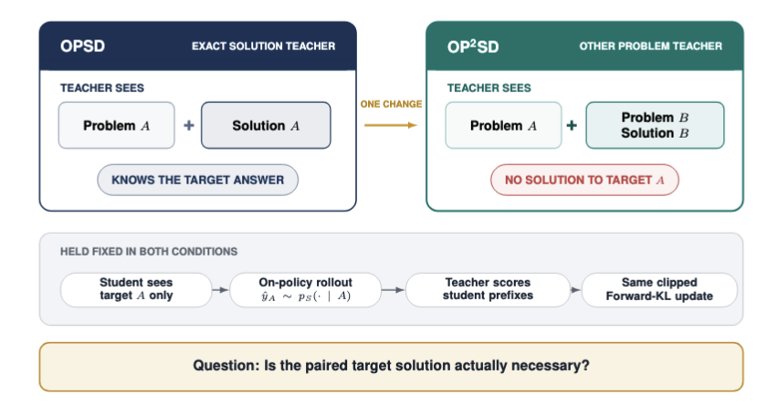

# OP²SD: On-Policy Self-Distillation from Other Problems

This directory is a self-contained research-code release for **OP²SD**. It
tests whether On-Policy Self-Distillation (OPSD) needs the verified solution
to the *same* problem that the student is solving.

In standard OPSD, the frozen self-teacher sees the target problem and its
paired reference solution. OP²SD changes only that teacher-side context: the
paired solution is replaced by a worked solution to a different problem.
The student rollout, frozen base-model teacher, LoRA update, and token-level
distillation objective remain unchanged.



The main finding is diagnostic: **a paired target solution is not necessary
for an OPSD-like accuracy gain in the evaluated settings**. This does not mean
that arbitrary context works; the accompanying paper studies several failure
and control conditions.

## Results snapshot

Avg@12 is the percentage of correct generations, with 12 generations per
problem. Each row below averages four decoding seeds on a fixed 30-problem
benchmark. Values after `±` are corrected Monte Carlo standard errors for
decoding randomness; they are **not** uncertainty over training seeds or test
problems.

| Model | Evaluation | Benchmark | Base | OPSD | OP²SD | Compared checkpoints (OPSD / OP²SD) |
|---|---|---|---:|---:|---:|---:|
| Qwen3-1.7B | thinking | AIME 2024 | 49.86±0.94 | **55.42±0.82** | 55.35±0.83 | 100 / 100 |
| Qwen3-1.7B | thinking | AIME 2025 | 37.36±0.81 | 40.35±0.77 | **40.69±0.74** | 50 / 50 |
| Qwen3-1.7B | thinking | HMMT 2025 | 23.61±0.64 | 25.76±0.63 | **27.57±0.66** | 100 / 100 |
| Qwen3-4B | non-thinking | AIME 2024 | 23.19±0.72 | 30.76±0.77 | **31.53±0.80** | 100 / 50 |
| Qwen3-4B | non-thinking | AIME 2025 | 21.11±0.64 | 23.06±0.65 | **30.62±0.71** | 100 / 50 |
| Qwen3-4B | non-thinking | HMMT 2025 | 11.67±0.49 | 15.42±0.57 | **16.11±0.60** | 100 / 50 |
| Qwen3-8B | non-thinking | AIME 2024 | 28.47±0.75 | 45.00±0.86 | **55.83±0.87** | 50 / 50 |
| Qwen3-8B | non-thinking | AIME 2025 | 20.97±0.63 | 32.15±0.76 | **42.85±0.71** | 50 / 50 |
| Qwen3-8B | non-thinking | HMMT 2025 | 11.81±0.51 | 16.18±0.60 | **25.56±0.72** | 50 / 50 |

OP²SD has the highest Avg@12 point estimate in eight of the nine groups.
These are selected checkpoint comparisons from one training run per
condition, not claims of statistical equivalence or universal superiority.
The 4B comparison uses unequal selected checkpoints, and output-length
behavior is not consistent across model sizes. 

## Repository layout

```text
OP2SD/
├── src/
│   ├── op2sd/donors.py       # deterministic, disjoint donor assignment
│   ├── op2sd/prompts.py      # public teacher-prompt construction
│   ├── data_collator.py      # student/teacher prompt tokenization
│   ├── opsd_train.py         # data preparation and training entry point
│   └── opsd_trainer.py       # on-policy generation and distillation
├── scripts/
│   ├── train.sh              # OPSD or OP²SD, 1.7B/4B/8B profiles
│   ├── evaluate.sh           # multiseed evaluation and aggregation
│   └── preflight.sh          # imports plus unit tests
├── eval/
│   ├── evaluate_math.py
│   └── aggregate_multiseed.py
├── tests/
├── examples/
└── results/
```


## Installation

The tested stack uses Python 3.10, PyTorch 2.8, Transformers 4.57.1, TRL
0.26.0, vLLM 0.11.0, and DeepSpeed 0.18.2. The versions are pinned because
the implementation depends on the experimental `trl.experimental.gold` API.

```bash
conda env create -f environment.yml
conda activate opsd
pip install flash-attn==2.8.3 --no-build-isolation
bash scripts/preflight.sh
```

The paper runs use four CUDA GPUs and BF16. Model IDs can be downloaded by
Hugging Face automatically, or `MODEL_ID_OR_PATH` can point to a local model
directory.

## Training

The public launcher selects the paper profile from `MODEL_SIZE`. The default
is the Qwen3-4B, both-non-thinking OP²SD configuration.

```bash
CUDA_VISIBLE_DEVICES=0,1,2,3 \
METHOD=op2sd \
MODEL_SIZE=4b \
WANDB_MODE=offline \
bash scripts/train.sh
```

Train the matched target-solution OPSD baseline by changing one variable:

```bash
CUDA_VISIBLE_DEVICES=0,1,2,3 \
METHOD=opsd \
MODEL_SIZE=4b \
WANDB_MODE=offline \
bash scripts/train.sh
```

Default profiles:

| Profile | GPUs | Per-device batch | Grad. accumulation | Effective batch | Steps | Student / teacher mode | Token clip | LR schedule |
|---|---:|---:|---:|---:|---:|---|---:|---|
| 1.7B | 4 | 4 | 2 | 32 | 100 | non-thinking / thinking | 0.05 | linear |
| 4B | 4 | 4 | 2 | 32 | 100 | non-thinking / non-thinking | 1e-6 | constant |
| 8B | 4 | 2 | 4 | 32 | 50 | non-thinking / non-thinking | 1e-7 | constant |

All profiles use learning rate `5e-6`, maximum gradient norm `0.1`, LoRA
`r=64`, `alpha=128`, dropout `0.05`, maximum student completion length 1,024,
training seed 42, a frozen adapter-disabled base teacher, full-vocabulary
Forward KL (`beta=0`), and on-policy sampling at temperature 1.1, top-p 0.95,
top-k 20.

Outputs are written to `outputs/$RUN_NAME/`. Every checkpoint records the
resolved OP²SD donor mapping metadata and hashes in trainer state/config logs.
W&B is disabled by default; set `WANDB_MODE=online` explicitly if desired.

## Data and donor assignment

By default, training loads
[`siyanzhao/Openthoughts_math_30k_opsd`](https://huggingface.co/datasets/siyanzhao/Openthoughts_math_30k_opsd).
Target rows require `problem` and `solution`; the main intervention also uses
the `source` field. Its donor pool is restricted to the `amc_aime` and
`aops_forum` source labels.

For seed 1729, `op2sd.donors` assigns donor rows deterministically and nearly
uniformly. It rejects any target/donor pair with identical normalized problem
text. The paired target solution remains available for grading and diagnostics
but is never placed in the active OP²SD teacher prompt.

An external JSON or JSONL donor set can be supplied instead:

```bash
METHOD=op2sd \
MODEL_SIZE=4b \
DONOR_DATASET_PATH=examples/donors.example.jsonl \
bash scripts/train.sh
```

Each row must have this schema:

```json
{"problem": "another problem", "solution": "its worked solution"}
```

External donor problem texts must be unique and disjoint from all target
problem texts. A one-row donor file intentionally fixes the same unrelated
example for every target.


## Evaluation

Evaluate an OP²SD LoRA checkpoint and aggregate four decoding seeds:

```bash
CUDA_VISIBLE_DEVICES=0,1,2,3 \
MODEL_ID_OR_PATH=Qwen/Qwen3-4B \
CHECKPOINT_DIR=outputs/qwen3_4b_op2sd_steps100_seed42/checkpoint-50 \
METHOD_TAG=op2sd_ckpt50 \
DATASET=aime24 \
ENABLE_THINKING=0 \
TENSOR_PARALLEL_SIZE=4 \
bash scripts/evaluate.sh
```

For the 1.7B main evaluation, set `MODEL_ID_OR_PATH=Qwen/Qwen3-1.7B` and
`ENABLE_THINKING=1`. For Base, leave `CHECKPOINT_DIR` empty and set
`METHOD_TAG=base`. Built-in aliases are `aime24`, `aime25`, and `hmmt25`; a
local evaluation JSON/JSONL can be passed with `DATASET_PATH`.

The evaluator writes one JSON per seed and one aggregate JSON/Markdown pair
under `eval_results/`. `Vote@12` reproduces the research implementation: it
counts **raw extracted answer strings**, selects the most frequent string, and
then grades that winner with `math_verify`. It does not cluster all predictions
by mathematical equivalence.

## Tests

```bash
export PYTHONPATH="$PWD/src"
python -m unittest discover -s tests -p 'test_*.py'
```

## Reference

```bash
@article{ichihara2026privileged,
  title={Privileged Solutions or Context-Induced Teacher Behavior? Dissecting On-Policy Self-Distillation},
  author={Ichihara, Yuki and Iwase, Naoto and Quamar, Mohammad Atif and Komiyama, Junpei},
  journal={arXiv preprint arXiv:2608.09228},
  year={2026}
}
```
